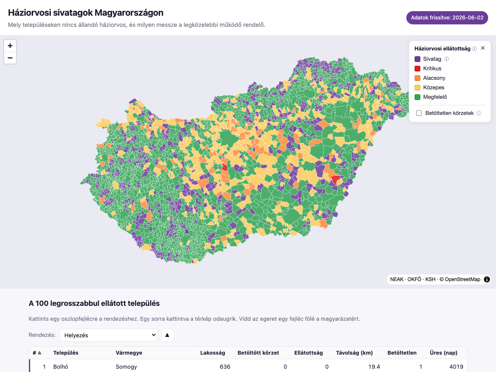

# GP Desert Map — Hungary

*Háziorvosi sivatagok Magyarországon* ("GP deserts in Hungary")

[](https://github.com/haloadam/where-is-my-doctor/actions/workflows/tests.yml)
[](LICENSE)

**Live map:** <https://haloadam.github.io/where-is-my-doctor/> &nbsp;·&nbsp; **Source:** <https://github.com/haloadam/where-is-my-doctor>

A free, static, monthly-updated interactive map of general-practitioner access across every
Hungarian settlement. It shows which settlements have **no functioning family doctor**
(their *háziorvosi körzet* — GP practice district — is vacant), how far residents must drive to the
nearest working doctor, and which practices are unfilled.

Built from official open data, rendered with MapLibre + PMTiles, and hosted on GitHub Pages.

> **A note on language.** The user interface is entirely in Hungarian (its audience is the Hungarian
> public). This README is in English; wherever a Hungarian term or place name appears it is written in
> *italics*, with an English gloss in parentheses on first use.



## What it shows

- A **choropleth** coloured by GP access (`gps_per_1000`, computed only from *functioning* practice
  districts): green = good · yellow = moderate · orange = low · red = critical · **purple = desert**.
- A settlement is a **desert** when every *körzet* (practice district) serving it is *betöltetlen*
  (vacant) — the permanent doctor's post is empty (a temporary substitute may still visit). This is
  about 21% of settlements, mostly small villages.
- A toggleable **vacancy overlay**: currently vacant and *tartósan betöltetlen* (persistently vacant,
  i.e. empty for more than six months) districts shown as points; persistent ones get a yellow ring.
- **Click any settlement** to see its population, its working and vacant district counts, GPs per
  1,000 residents, the nearest working doctor and the driving distance to it, and how long the post
  has been empty.
- A sortable **"100 worst-served settlements"** table and a **data-freshness** badge.

## Data sources

| Input | Source | Notes |
|---|---|---|
| Active GP practices | NEAK, *Háziorvosi szolgálatok* (GP services) XLSX | 6,367 districts; one column lists each district's served settlements by KSH code |
| Vacant practices | NEAK, *Betöltetlen háziorvosi szolgálatok* (vacant GP services) PDF | 1,021 vacant districts (parsed as text, no OCR) |
| Persistence flag | OKFŐ, *tartósan betöltetlen* (persistently vacant) HTML table | adds the "vacant for more than six months" flag |
| Population + KSH codes | KSH *Helységnévtár* (the official gazetteer) XLSX | per-settlement resident population |
| Settlement geometry | OpenStreetMap `admin_level=8` (czinkos Gist) | 3,155 settlements |

Acronyms: **NEAK** = *Nemzeti Egészségbiztosítási Alapkezelő* (National Health Insurance Fund);
**OKFŐ** = *Országos Kórházi Főigazgatóság* (National Directorate General for Hospitals);
**KSH** = *Központi Statisztikai Hivatal* (Hungarian Central Statistical Office).

Licensing: KSH data is CC BY 4.0 (attribution *"Forrás: KSH"*, i.e. "Source: KSH"). The NEAK/OKFŐ
vacancy lists are *közérdekű* (public-interest) data published by district. OpenStreetMap boundaries
are ODbL. Source links are in the page footer.

> **Methodology.** Nearest-doctor distances are **real driving distance and time** computed with OSRM
> road routing; where no route exists, a straight-line × 1.4 estimate is the fallback. Road distances
> are precomputed into a committed cache (`processed/road_cache.csv`) and refreshed occasionally — see
> [`docs/v2-routing-plan.md`](docs/v2-routing-plan.md). Budapest is treated as a single unit (its 23
> *kerület* (city-district) practices are aggregated to match the one OSM city polygon).

## Quickstart

The system Python is often 3.14, which is too new for the geospatial wheels, so the pipeline pins
**Python 3.12**.

```bash
brew install python@3.12 tippecanoe     # toolchain
bash scripts/bootstrap.sh               # create .venv (3.12) and install requirements
. .venv/bin/activate

python pipeline/run_all.py              # fetch live sources → parse → score → emit → build tiles
bash scripts/build_site.sh              # assemble dist/
python scripts/serve.py 8080 dist       # Range-capable preview (http.server will not work — PMTiles needs Range requests)
# open http://localhost:8080
```

`run_all.py` runs steps `01`–`07` and then builds the tiles. Step `07` runs the full assertion suite
and **exits non-zero on any hard failure**, so a broken upstream file fails the build instead of
publishing bad data.

## Pipeline

```
pipeline/
  00_config.py          constants, source URLs, assertion baselines
  01_download.py        fetch 4 sources → raw/ (dated snapshot, magic-byte check, fail-safe reuse)
  02_parse_active.py    active-practices XLSX → explode the served-settlements column → memberships
  03_parse_vacancy.py   vacancy PDF (pdfplumber) + OKFŐ HTML → vacancies (cross-checked)
  04_parse_ksh.py       KSH gazetteer → canonical 3,155-settlement universe (Budapest aggregated)
  05_geometry_bridge.py OSM admin_level=8 polygons, name-joined to KSH codes (3,155/3,155, 100%)
  06_join_and_score.py  functioning vs vacant districts → access class, desert flag, nearest doctor
  07_emit.py            settlements.geojson + vacant points + worst-100 + meta + run ALL assertions
  08_road_cache.py      OSRM road-distance cache (v2 routing; occasional, NOT part of run_all)
  run_all.py            orchestrator (01–07 + build_tiles.sh)
```

**Routing (v2).** `scripts/osrm_build.sh` self-hosts OSRM (Docker, with the Hungary OSM extract) and
`pipeline/08_road_cache.py` precomputes `processed/road_cache.csv` — for each settlement, the driving
distance to its nearest doctor-hosting settlements. Step `06` prefers these real road distances and
falls back to straight-line × 1.4 only where no route exists. Compare the two methods with
`python scripts/compare_routing.py`. Full design: [`docs/v2-routing-plan.md`](docs/v2-routing-plan.md).

`raw/`, `interim/` and `osrm/` are gitignored (re-derivable). The committed outputs are
`tiles/settlements.pmtiles`, `processed/road_cache.csv`,
`processed/{worst_100.*, meta.json, build_report.json}`, and `web/`.

## Deployment (GitHub Pages)

Three decoupled workflows using the official Pages flow:

- **`data.yml`** — monthly cron (and manual): fetches the sources, runs the pipeline, builds the
  tiles, and commits `processed/` + `tiles/`. No router or Docker at runtime.
- **`deploy.yml`** — on a data or web change (and manual): assembles `dist/` and deploys via
  `actions/deploy-pages`, from a clean checkout with no pipeline run.
- **`routing.yml`** — occasional (manual and roughly yearly): self-hosts OSRM and regenerates the
  committed road-distance cache. The monthly job never runs a router.

Enable Pages → *Build and deployment* → **GitHub Actions**, then trigger `deploy.yml` once.

## Tech

MapLibre GL JS plus a single `.pmtiles` archive (vector tiles, byte-range served). All display
properties are baked into the tiles, so styling and popups need no runtime data join. Libraries are
vendored (no CDN) so an unattended deploy never breaks. Target: under 8 MB of tiles and under 5 s to
first paint on mobile (currently about 4 MB).

## Development

```bash
pip install -r requirements-dev.txt   # adds pytest + ruff to the .venv
pytest                                # unit tests (tests/) — fast, hermetic, no network
ruff check .                          # lint + import sorting
```

Both run in CI on every push and pull request. Reusable logic lives in `pipeline/lib/` so it is
importable and unit-tested; the numbered `pipeline/NN_*.py` steps are thin orchestration around it.
The data contract between steps and the published outputs is documented in
[`SCHEMA.md`](SCHEMA.md). An optional pre-commit hook (`pre-commit install`) runs ruff before commits.

## Contributing

Contributions and data corrections are welcome — see [`CONTRIBUTING.md`](CONTRIBUTING.md) and the
[Code of Conduct](CODE_OF_CONDUCT.md). Please keep the source data's personal information (doctors'
names, addresses, phone numbers) out of committed artifacts; outputs are aggregated by settlement.

## License

Source code: **MIT** — see [`LICENSE`](LICENSE). The displayed data is from third parties under their
own terms: KSH (CC BY 4.0, *"Forrás: KSH"*), OpenStreetMap (ODbL), and the NEAK/OKFŐ public-interest
(*közérdekű*) datasets — full attribution is in the page footer and the "Data sources" section above.
